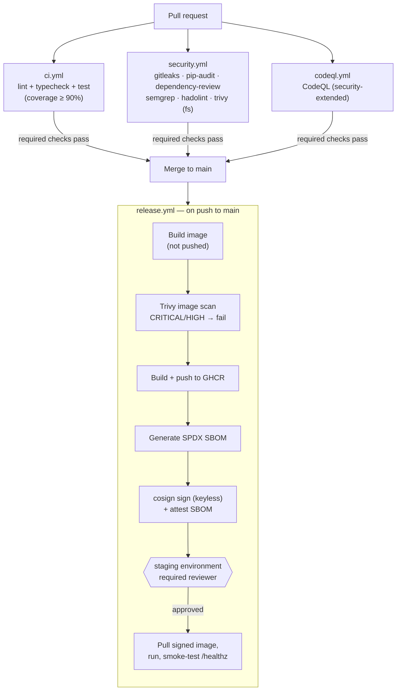

# Secure CI/CD Pipeline

A real GitHub Actions pipeline — not a diagram of one — built around a small
but genuine Flask API (a URL shortener, `app/`). Every push and pull request
runs through lint, type-check, tests with a coverage gate, and five
independent security scanners; every merge to `main` builds a container,
blocks the pipeline on any CRITICAL/HIGH vulnerability, signs the image
keylessly with cosign, attaches an SBOM, and only deploys after a human
approves a gated GitHub Environment.

## Why this exists

"CI/CD with security scanning" usually means one `npm audit` step bolted
onto a build job. The point of this repo is to show what a pipeline looks
like when security scanning is treated as seriously as the tests: multiple
scanners covering different threat classes (secrets, dependencies, code
patterns, container image, supply chain), each one actually gating the
pipeline rather than just producing a report nobody reads, plus a signed,
attested artifact and a deploy step that requires a real approval.

## Pipeline architecture



Findings from Trivy and CodeQL land in the repo's **Security** tab
(`security-events: write` + SARIF upload), not just in a job log — that's
what makes them visible without someone going and reading Actions output.

## What's actually enforced (not just present)

| Stage | Tool | Fails the pipeline when |
|---|---|---|
| Lint / format | ruff | Any lint violation or unformatted file |
| Types | mypy | Any type error in `app/` |
| Tests | pytest + coverage | Any test fails, or line coverage < 90% |
| Secrets | gitleaks | Any secret pattern found, including in past commits |
| Dependency CVEs | pip-audit (`--strict`) | Any known vulnerability in a pinned dependency |
| New-dependency risk (PRs) | `dependency-review-action` | A newly-introduced dependency is high/critical severity |
| SAST | Semgrep (`p/ci`) | Any finding from Semgrep's CI ruleset |
| SAST (deeper) | CodeQL (`security-extended`) | Findings surface in the Security tab (advisory — GitHub code scanning doesn't fail the run by default, but a branch-protection rule can require "no open CodeQL alerts") |
| Dockerfile | hadolint | Any Dockerfile anti-pattern |
| Image CVEs | Trivy | Any CRITICAL/HIGH vulnerability with a known fix |
| Supply chain | cosign | N/A — this stage *adds* verifiable provenance rather than gating; see below |

## Making main actually protected

None of the above matters unless it's wired into branch protection. In
**Settings → Branches → Branch protection rules** for `main`:

1. Require a pull request before merging, with at least 1 approval.
2. Require status checks to pass before merging, and select (once they've
   run at least once so GitHub knows about them): `Lint & format check`,
   `Type check (mypy)`, `Unit tests`, `Secret scanning (gitleaks)`,
   `Dependency vulnerabilities (pip-audit)`, `SAST (Semgrep)`,
   `Dockerfile lint (hadolint)`, `Filesystem vuln/misconfig scan (Trivy)`,
   `Analyze (python)` (CodeQL).
3. Require branches to be up to date before merging.
4. Optionally: require signed commits.

Then, in **Settings → Environments → staging**, add yourself (or a team) as
a required reviewer. That's the approval gate `deploy-staging` waits on in
`release.yml` — without it, the job runs unattended the moment `publish`
finishes.

## The deploy step is a stand-in, on purpose

`deploy-staging` pulls the image that was just signed and scanned, runs it,
and polls `/healthz` until it's up — a genuine smoke test, not a fake log
line. What it deliberately does *not* do is pretend to talk to a real
Kubernetes cluster or cloud account, because this repo doesn't have one to
demonstrate against honestly. In a real setup, the `docker run` +
smoke-test step is exactly where a `kubectl set image`, `helm upgrade`, or
`aws ecs update-service` call would go — the rest of the job (pull the
signed digest, wait for the `staging` environment's approval) doesn't
change.

## Running it locally

```bash
python -m venv .venv && source .venv/bin/activate
pip install -r requirements-dev.txt

ruff check . && ruff format --check .
mypy app
pytest                      # 12 tests, all exercising real request/response behavior

docker build -t shrtn:local .
docker run --rm -p 8080:8080 shrtn:local
curl -X POST localhost:8080/api/links -d '{"url":"https://example.com"}' -H 'content-type: application/json'
curl -i localhost:8080/<code-from-the-response>   # 302 redirect
```

## Repository layout

```
app/
  main.py           # Flask app factory + routes
  db.py             # SQLite persistence (parameterized queries only)
  requirements.txt  # runtime deps, shipped in the image
tests/
  test_api.py       # 12 tests against real app behavior, not mocks
.github/
  workflows/
    ci.yml           # lint, typecheck, test (every push/PR)
    security.yml     # gitleaks, pip-audit, dependency-review, semgrep, hadolint, trivy fs
    codeql.yml       # CodeQL security-extended
    release.yml      # build, scan, push, sign, SBOM, gated deploy (push to main)
  dependabot.yml      # weekly updates: pip (app + dev), docker base image, github-actions
Dockerfile             # non-root user, no curl/wget dependency in the healthcheck
requirements-dev.txt    # test/lint/scan tooling, not shipped in the image
pyproject.toml          # ruff, mypy, pytest, coverage config
SECURITY.md
```

## License

MIT — see [LICENSE](LICENSE).
